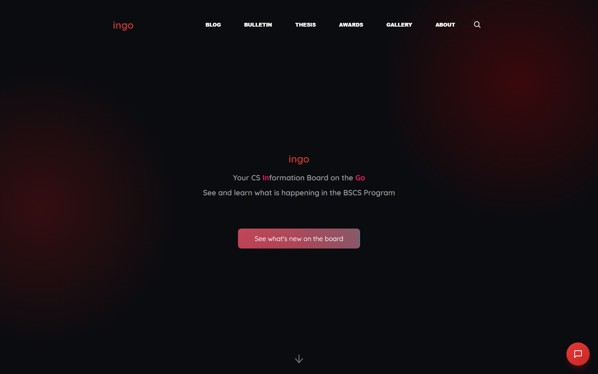
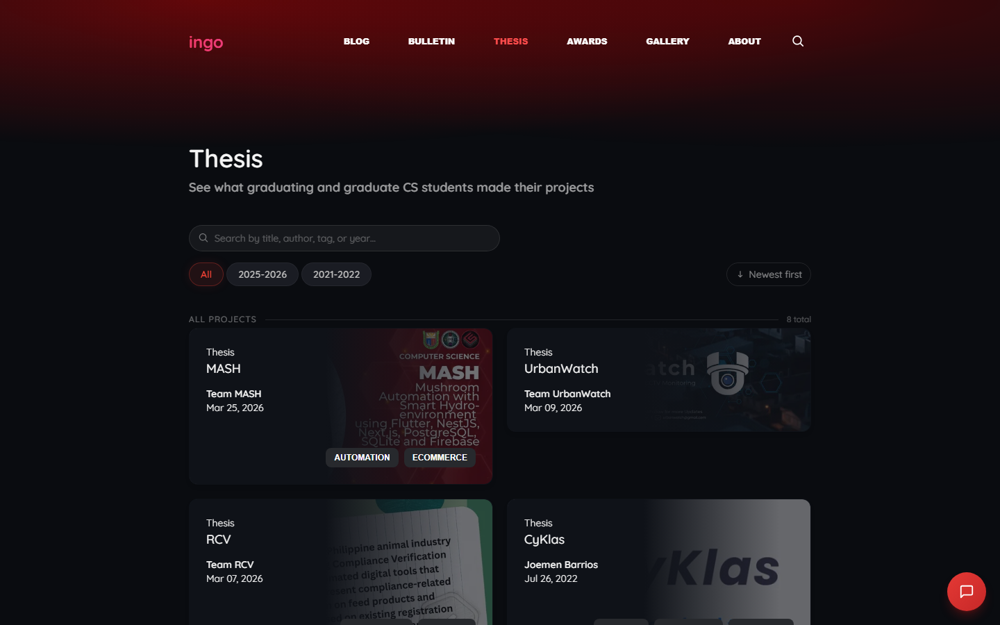
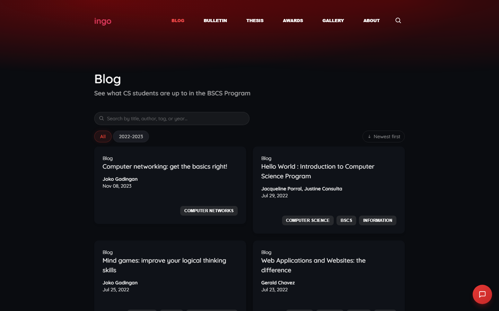
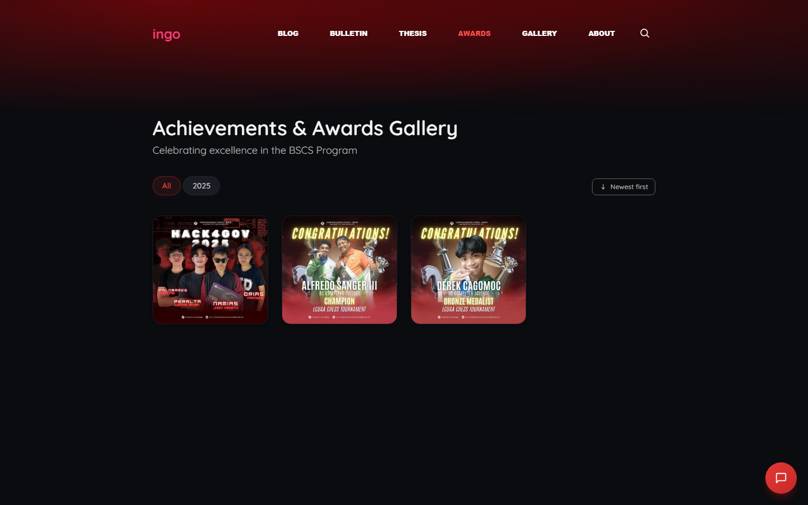
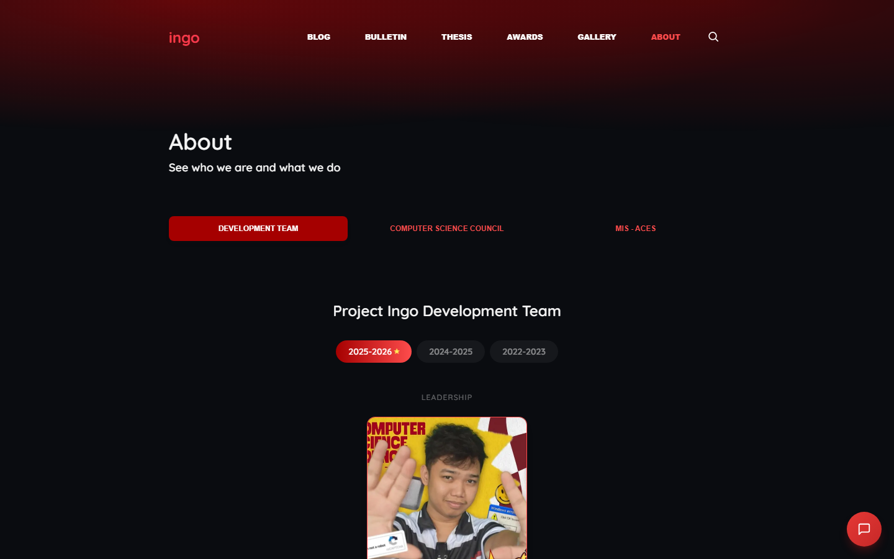
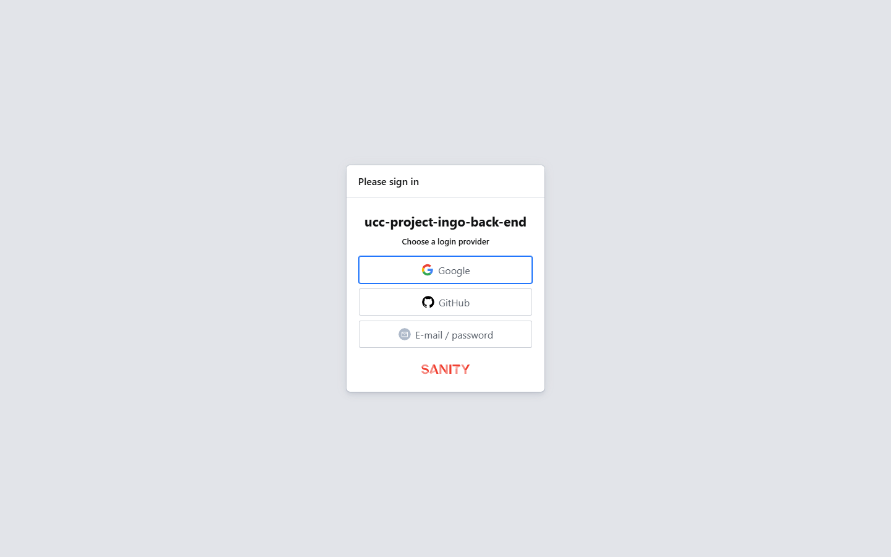

# UCC INGO

> **Branch note:** `main` is the stable production branch and auto-deploys to Vercel. For active development, use `feat/*` or `fix/*` branches and merge via pull requests.

```
                      .--.
                     /    \
         ____       |      |
        |    |      |      |
        |    |      |      |      ___
        |    |      |      |     |   |
        |____|      |      |     |___|
        |    |      |      |         |
        |    |      |      |         |
        |    |      |      |         |
        |____|      |______|     ____|____
   U   C     C       I  N  G   O
```

**BSCS Information Board -- Your CS Information on the Go.** A digital hub for the University of Caloocan City BSCS program: thesis archive, blog, bulletins, awards, gallery, and AI chatbot -- all managed through a Sanity CMS.

---

## Live Links

| Service | URL | Purpose |
|:--------|:----|:--------|
| **Website** | [uccingo.tech](https://uccingo.tech) | Public BSCS information board |
| **Sanity CMS** | [ucc-ingo.sanity.studio](https://ucc-ingo.sanity.studio) | Content management dashboard |
| **GitHub** | [github.com/computerscience-ucc/project-iron-ingot](https://github.com/computerscience-ucc/project-iron-ingot) | Source code repository |
| **CS Council FB** | [facebook.com/UCCBSCS2022](https://www.facebook.com/UCCBSCS2022) | Official CS Council page |
| **CS Council Email** | [ucc.computersciencecouncil@gmail.com](mailto:ucc.computersciencecouncil@gmail.com) | Contact the CS Council |
| **UCC Website** | [ucc-caloocan.edu.ph](https://www.ucc-caloocan.edu.ph) | University of Caloocan City |
| **Google AI Studio** | [aistudio.google.com/app/apikey](https://aistudio.google.com/app/apikey) | Get Gemini API key for chatbot |

---

## Features

### Website (`uccingo.tech`)

<details open>
<summary><b>Thesis Archive</b> -- searchable capstone project library</summary>

- Filter by year, department (BSCS/BSEMC/BSIT/BSIS), and tags
- Detail pages with: hero carousel, IMRaD content, materials list, members grid
- 3D model viewer (GLB/GLTF) and showcase image gallery in a tabbed panel
- YouTube video embeds and related thesis links
- Downloadable materials with labeled icons (Document, GitHub, Dataset, Video)
</details>

<details open>
<summary><b>Blog & Bulletin System</b> -- articles and announcements</summary>

- Rich text with images (PortableText) and author profiles
- Year filters, sort by date, paginated listing (10 per page)
- Tags for cross-content search
</details>

<details open>
<summary><b>Awards Hub</b> -- achievement showcase</summary>

- Masonry grid layout with year filters
- Image lightbox with keyboard navigation
- Recipient profiles with photos and batch info
- Badges, categories, rich-text descriptions
</details>

<details open>
<summary><b>Gallery of Works</b> -- student project showcase</summary>

- YouTube video embeds, GitHub repository links, LinkedIn profiles
- Year and category filters with pagination
</details>

<details open>
<summary><b>CS Council & Dev Team Rosters</b> -- dynamic org charts</summary>

- Organized by academic year with year selector
- Pyramid layout: Adviser -> President -> VP -> Officers -> Committees
- Person lightbox with photo, keyboard navigation, swipe gestures
- Auto-scrolling carousels for large committees
</details>

<details open>
<summary><b>AI ChatBot (Ingo Bot)</b> -- thesis-aware assistant</summary>

- Powered by Google Gemini 2.5 Flash with full thesis context
- Commands: `/blog`, `/thesis`, `/bulletin`, `/awards`, `/gallery`, `/about`, `/help`, `/clear`
- Rate-limited (10 msg/min), 600-char max, auto-ban at abuse thresholds
- Sliding drawer UI with typing indicators and suggestion chips
- Chat history persisted in sessionStorage
</details>

<details open>
<summary><b>Global Search</b> -- <code>Ctrl+K</code> / <code>Cmd+K</code></summary>

- Searches all content types by title and tags
- Results grouped by type with keyboard navigation
</details>

<details open>
<summary><b>Design & UX</b></summary>

- Dark theme with light mode toggle (colors customizable via CMS)
- Smooth scroll (Lenis, 1.2s duration)
- Responsive: mobile, tablet, desktop
- Custom pixel fonts (GeistPixel, Advine-Pixel, Minecraft)
- Three.js background scene (rotating cube with thesis marquee)
- Mouse-following mascot trail on the homepage
</details>

<details open>
<summary><b>SEO & Performance</b></summary>

- Static Site Generation (SSG) with 10-second ISR revalidation
- Open Graph, Twitter Cards, JSON-LD structured data
- Customizable meta tags via CMS Site Configuration
- XML sitemap and robots.txt
</details>

---

## Screenshots

<details>
<summary>Click to expand screenshots</summary>

### Homepage


### Thesis Archive


### Blog


### Awards


### About / Council


### Sanity CMS (login)


</details>

---

## Tech Stack

| Layer | Technology |
|:------|:-----------|
| **Framework** | Next.js 15 (pages router), React 18 |
| **Styling** | Tailwind CSS 3, shadcn/ui, Material Tailwind |
| **CMS** | Sanity Studio v3 (standalone deployment) |
| **AI** | Google Gemini 2.5 Flash |
| **Animations** | Framer Motion 12, Three.js (React Three Fiber), Lenis |
| **Icons** | Lucide React, Geist Icons, React Icons |
| **Fonts** | Geist (body), GeistPixel (display), Advine-Pixel, Minecraft |
| **Deployment** | Vercel (website), Sanity Hosting (CMS) |
| **Database** | Sanity CDN -- project `gjvp776o`, dataset `production` |

---

## Architecture

```
+------------------+       +------------------+
|  Content Editors |       |  Website Visitors |
|  (CS Council)    |       |  (public)         |
+--------+---------+       +--------+---------+
         |                          |
         v                          v
+------------------+       +------------------+
|  Sanity Studio   |       |  Next.js 15      |
|  (CMS)           |---.   |  (SSG + ISR)     |
|  ucc-ingo.sanity |   |   |  uccingo.tech    |
|  .studio         |   |   +--------+---------+
+------------------+   |            |
         |             |            v
         v             |   +------------------+
+------------------+   |   |  Google Gemini   |
|  Sanity CDN      |<--'   |  2.5 Flash       |
|  (GROQ queries)  |       |  (/api/chat)     |
+------------------+       +------------------+
```

1. **Editors** publish content in the Sanity Studio
2. **Sanity CDN** serves data via GROQ queries
3. **Next.js** generates static pages at build time (SSG) with 10-second ISR
4. **Google Gemini** powers the AI chatbot with thesis context injected

---

## Content Management Guide

The CMS at [ucc-ingo.sanity.studio](https://ucc-ingo.sanity.studio) lets CS Council officers manage all site content. You need a Sanity account invited to project `gjvp776o`.

### CMS Sidebar Layout

When you log in, the sidebar lists all content types:

```
Site Configuration     <- Global settings (singleton)
Authors                <- Reusable person profiles
Recipients             <- Award recipient profiles
-----------------------
Blog Posts             <- Articles and tutorials
Bulletins              <- Official announcements
Theses                 <- Capstone project archive
Awards                 <- Achievements hub
Gallery of Works       <- Student project showcase
CS Council             <- Officer rosters by year
Dev Team               <- Dev team by year
Hero Carousel          <- Homepage banner slides
```

Click any type to see documents. Click the **+** or **Create new** button to add content. All documents have a **Publish** button in the bottom-left corner.

### How to Add a Thesis

1. Sidebar -> **Theses** -> **Create new**
2. Fill in:

   | Field | Required | Details |
   |:------|:--------:|:--------|
   | Header Image | Yes | Main banner for the thesis page |
   | Thesis Title | Yes | Full project title |
   | Slug | Yes | URL path (auto-generates from title) |
   | Owner's Info | Yes | Proponent names + section |
   | Academic Year | Yes | e.g. "2025-2026" |
   | Department | Yes | BSCS / BSEMC / BSIT / BSIS |
   | Thesis Content | Yes | Main body (rich text + images) |
   | IMRAD Content | No | Full paper text for chatbot Q&A |
   | Members | No | Names, photos, LinkedIn, website |
   | Gallery Images | No | Hero carousel photos |
   | YouTube Link | No | Walkthrough video embed |
   | 3D Model | No | GLB/GLTF file for interactive viewer |
   | Showcase Images | No | Right panel gallery (fallback if no 3D model) |
   | Materials | No | Downloadable resources (paper, GitHub, dataset, video) |
   | Tags | No | Keywords for search/filtering |

3. Click **Publish**
4. View at `uccingo.tech/thesis/[slug]`

### How to Add a Blog Post

1. Sidebar -> **Blog Posts** -> **Create new**
2. Add: header image, title, slug, author(s), academic year, tags
3. Write **Blog Content** with the rich text editor
4. **Publish** -- view at `uccingo.tech/blog/[slug]`

### How to Add a Bulletin

1. Sidebar -> **Bulletins** -> **Create new**
2. Add: header image, title, slug, author(s), tags
3. Write **Bulletin Content** -- **Publish**
4. View at `uccingo.tech/bulletin/[slug]`

### How to Add an Award

1. Sidebar -> **Awards** -> **Create new**
2. Add: header image, title, slug, category, badges, images, academic year
3. Select or create a **Recipient** (name, photo, batch year)
4. Write description, add tags -- **Publish**
5. View at `uccingo.tech/awards/[slug]`

### How to Add a Gallery Item

1. Sidebar -> **Gallery of Works** -> **Create new**
2. Add: project title, slug, person name, profile picture
3. Paste the **YouTube embed URL** (full link, not just video ID)
4. Add GitHub URL and LinkedIn profile URL
5. Write project summary, add tags, upload images -- **Publish**
6. View at `uccingo.tech/gallery/[slug]`

### How to Update the CS Council

1. Sidebar -> **CS Council** -> **Create new** (or edit existing)
2. Set **Academic Year** (e.g. "2025-2026")
3. Toggle **Current Year** ON for the active council
4. Fill in: Adviser, President, VP, Officers, Committees, Year Reps, Class Presidents
5. **Publish** -- view at `uccingo.tech/about`

### How to Update the Dev Team

1. Sidebar -> **Dev Team** -> **Create new**
2. Add leadership and department sections with members
3. **Publish**

### Customizing Site Settings

**Site Configuration** is a singleton. Click it in the sidebar to edit:

| Section | What You Can Change |
|:--------|:--------------------|
| SEO & Metadata | Site title, tagline, description, keywords |
| Branding | Logo, OG image, Apple touch icon, favicon |
| Theme Colors | Background, button, nav bar, header, scrollbar (hex values) |
| AI Chatbot | Enable/disable, model selection, system prompt, welcome message |
| Social Links | Facebook, Twitter, Instagram URLs, contact email, copyright text |

Changes go live site-wide immediately after **Publish**.

---

## Getting Started (Local Development)

### Prerequisites

- Node.js 18+
- npm
- Gemini API key from [aistudio.google.com/app/apikey](https://aistudio.google.com/app/apikey)

### Setup

```bash
git clone https://github.com/computerscience-ucc/project-iron-ingot.git
cd project-iron-ingot

# Install front-end dependencies
npm install

# Install CMS dependencies
cd studio && npm install && cd ..

# Create .env and add your Gemini key
# Copy from .env.example or use:
# GEMINI_API_KEY=your_key_here
```

### Start Development

```bash
npm run dev
```

This starts both servers concurrently:
- **Website** at [http://localhost:3000](http://localhost:3000)
- **Sanity Studio** at [http://localhost:3333](http://localhost:3333)

### Available Commands

| Command | Description |
|:--------|:------------|
| `npm run dev` | Start website + CMS |
| `npm run dev:next` | Start only Next.js on :3000 |
| `npm run dev:studio` | Start only Sanity Studio on :3333 |
| `npm run build` | Build Next.js for production |
| `npm run start` | Serve production build |
| `npm run lint` | Run ESLint |

---

## Deployment

### Website (Vercel)

The `main` branch auto-deploys. Manual deploy:

```bash
npm run build
npx vercel --prod
```

**Environment variables** (set in Vercel dashboard):

| Variable | Value |
|:---------|:------|
| `NEXT_PUBLIC_SANITY_PROJECT_ID` | `gjvp776o` |
| `NEXT_PUBLIC_SANITY_DATASET` | `production` |
| `NEXT_PUBLIC_SANITY_API_VERSION` | `2023-10-01` |
| `GEMINI_API_KEY` | *(your Gemini API key)* |

### CMS (Sanity Hosting)

```bash
cd studio
npm run deploy
# or: npx sanity deploy
```

First deploy prompts for a hostname (e.g. `ucc-ingo`). The CMS is then live at:
`https://<hostname>.sanity.studio`

---

## Environment Variables

| Variable | Required | Default | Description |
|:---------|:--------:|:--------|:------------|
| `NEXT_PUBLIC_SANITY_PROJECT_ID` | Yes | `gjvp776o` | Sanity project identifier |
| `NEXT_PUBLIC_SANITY_DATASET` | Yes | `production` | Sanity dataset name |
| `NEXT_PUBLIC_SANITY_API_VERSION` | No | `2023-10-01` | Sanity API version |
| `SANITY_API_TOKEN` | No | *(blank)* | Only needed for private datasets |
| `GEMINI_API_KEY` | Yes | *(none)* | Google Gemini API key |

---

## Troubleshooting

| Symptom | Cause | Fix |
|:--------|:------|:----|
| ChatBot returns errors | Missing or expired Gemini key | Update `GEMINI_API_KEY` in `.env` or Vercel |
| Studio blank page / white screen | Schema JS syntax error | Check Vite console for the specific schema file |
| Images not loading in production | CDN not whitelisted | Already configured in `next.config.mjs` |
| `rxjs.shareReplay is not a function` | Old rxjs v6 in root `node_modules` | Delete `../node_modules/rxjs` and reinstall |
| `sanity start` not recognized | v2 command with v3 CLI | Use `npx sanity dev` instead |
| Build fails | Dependency mismatch | Run `npm install` in both root and `studio/` |

---

## Project Structure

```
pages/                    Next.js routes
  index.js                Landing page
  about/index.js          About / Council / Dev Team
  blog/                   Blog listing + detail
  bulletin/               Bulletin listing + detail
  thesis/                 Thesis listing + detail
  awards/                 Awards listing + detail
  gallery/                Gallery listing + detail
  api/chat.js             Gemini chatbot API

components/               Reusable UI
  Prefetcher.js           Global data context
  ChatBot.js              AI ChatBot widget
  Navbar.js               Navigation + mobile menu
  SearchModal.js          Ctrl+K global search
  Card/                   Content cards
  Awards/                 Awards subcomponents
  Thesis/                 Thesis subcomponents
  Team/                   Council/Team subcomponents
  Home/                   Homepage subcomponents
  About/                  About page subcomponents
  ui/                     shadcn/ui primitives

layouts/                  Page sections
  Hero.js, Footer.js, FeaturesList.js,
  AwardsSection.js, LatestOnIngo.js,
  Council.js, FAQ.js, HappyCodingSection.js

lib/                      Shared utilities
  sanity.js               Sanity client + data fetching
  siteConfig.js           Cached site configuration
  animations.js           Animation variants

studio/                   Standalone Sanity CMS
  sanity.config.js        CMS configuration
  sanity.cli.js           CLI config
  deskStructure.js        Custom sidebar
  schemas/                11 schema types
    schema.js             Schema registry
    blog.js, bulletin.js, thesis.js,
    award.js, gallery.js, council.js,
    devTeam.js, heroCarousel.js, siteConfig.js
    documents/author.js, documents/recipient.js

public/                   Static assets
  branding/               Logo, favicon, OG image
  mascot/                 CS Bot mascot images
  fonts/                  Custom pixel fonts
  screenshots/            README screenshots
  sitemap.xml, robots.txt

styles/                   CSS
  globals.css             Tailwind + custom styles
  base/_colors.css        Theme color variables
  base/_typography.css    Font definitions
  layout/_containers.css  Container classes
```

---

## Contributing

1. Branch from `main`: `git checkout -b feat/your-feature`
2. Make changes and commit
3. Push and open a Pull Request
4. CS Council Dev Team lead reviews and merges

See [AGENTS.md](./AGENTS.md) for the full maintenance guide -- Sanity v3 migration notes, Git strategy, and key contacts.

---

<div align="center">
  <sub>Built by the UCC Computer Science Council Dev Team</sub>
  <br>
  <sub>University of Caloocan City -- BSCS Program</sub>
  <br>
  <sub>MIT License</sub>
</div>

---

*Need help? Contact the CS Council at [ucc.computersciencecouncil@gmail.com](mailto:ucc.computersciencecouncil@gmail.com) or reach out to the current Dev Team lead.*
