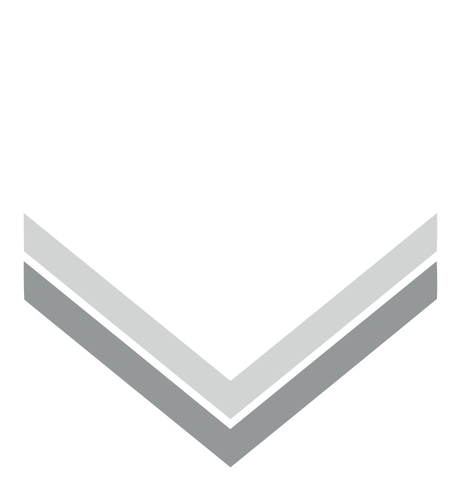
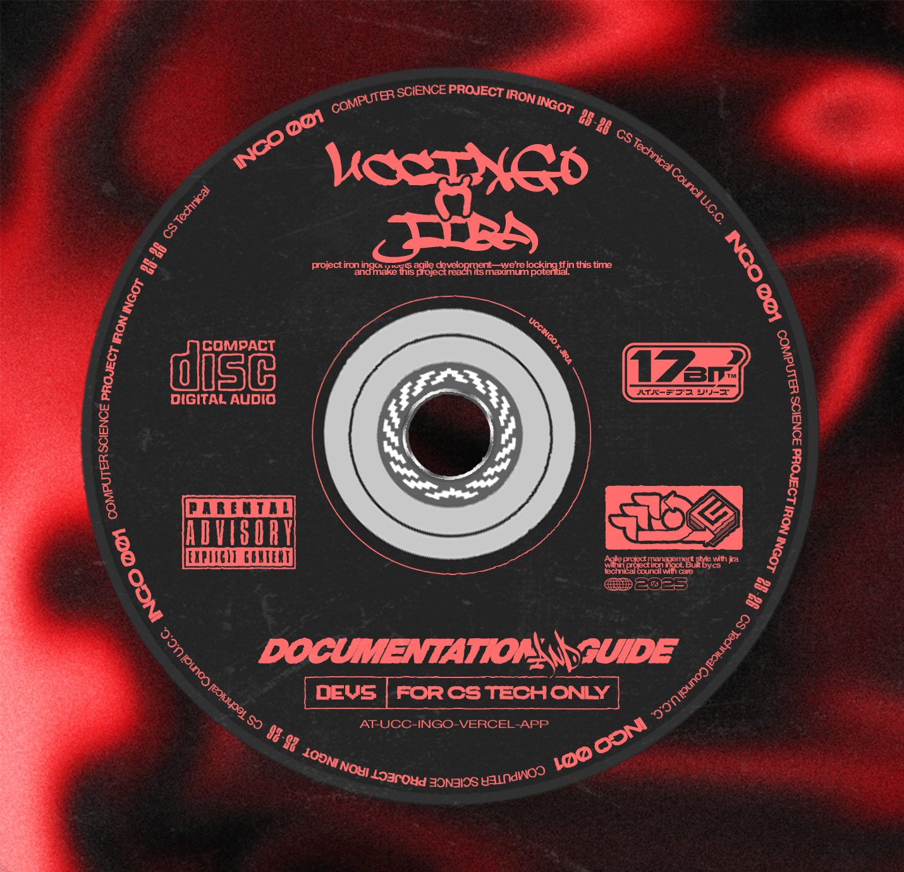

<div align="center">
  
  <h1>UCC INGO</h1>
  <p><strong>BSCS Information Board — Your CS Information on the Go</strong></p>
  <p>
    <a href="https://uccingo.tech" target="_blank">🌐 Website</a> •
    <a href="#-content-management-guide">📝 Content Guide</a> •
    <a href="./AGENTS.md">📖 Maintenance Guide</a> •
    <a href="https://github.com/computerscience-ucc/project-iron-ingot" target="_blank">💻 GitHub</a>
  </p>
</div>

---

## 📸 Preview

| Homepage | Thesis Detail | Sanity Studio (CMS) |
|:---:|:---:|:---:|
| Landing page with hero, awards, latest content, council, FAQ | Full thesis view with 3D models, galleries, materials | Content editor for blogs, theses, awards, council |
|  |  | *(See Content Management Guide below)* |

---

## 🚀 Live Links

| Service | URL | Purpose |
|:---|---|:---|
| **Website** | [https://uccingo.tech](https://uccingo.tech) | Public BSCS information board |
| **Sanity CMS** | *(deploy with `sanity deploy`)* | Content management backend |
| **GitHub** | [github.com/computerscience-ucc/project-iron-ingot](https://github.com/computerscience-ucc/project-iron-ingot) | Source code repository |
| **CS Council FB** | [facebook.com/UCCBSCS2022](https://www.facebook.com/UCCBSCS2022) | Official CS Council page |
| **UCC Website** | [ucc-caloocan.edu.ph](https://www.ucc-caloocan.edu.ph) | University of Caloocan City |

---

## ✨ Features

- **📰 Blog & Bulletin System** — Publish articles and official announcements via Sanity CMS
- **🎓 Thesis Archive** — Browse, filter by year/department/tag, and view full thesis details with 3D models, image galleries, YouTube embeds, and downloadable materials
- **🏆 Awards Hub** — Showcase achievements with rich text, image lightbox, and recipient profiles
- **🏛️ CS Council & Dev Team** — Dynamic rosters with year selector, committees, class presidents, and person lightbox
- **🤖 AI ChatBot (Ingo Bot)** — Guided conversation tree that answers questions about theses, blogs, bulletins, and awards using Google Gemini 2.5 Flash
- **🔍 Global Search** — Press `Ctrl+K` to search across all content types (blogs, bulletins, theses, awards, gallery)
- **📱 Fully Responsive** — Optimized for mobile, tablet, and desktop with smooth scroll (Lenis)
- **🎨 3D Visuals** — Three.js scene and 3D model viewer for thesis projects with GLB/GLTF support
- **🌙 Dark Theme** — Modern dark UI with customizable theme colors via Sanity Site Configuration
- **🔗 Social Integration** — Facebook, Discord, GitHub links in navbar and footer
- **⚡ Fast** — Static Site Generation with Incremental Static Regeneration (ISR revalidates every 10s)

---

## 🛠️ Tech Stack

<div align="center">

| Layer | Technology |
|:---|---|
| **Front-end** |    |
| **CMS** |  |
| **AI** |  |
| **Animations** |   |
| **Deployment** |  |

</div>

Full list: Next.js 15, React 18, Tailwind CSS 3, shadcn/ui, Material Tailwind, MUI, Framer Motion, Three.js, Lenis, Sanity v3, Google Gemini, Vercel.

---

## 📖 Content Management Guide

This guide shows **CS Council officers and editors** how to add and manage content using the Sanity Studio.

### Accessing the CMS

**Locally:**
```bash
cd studio
npx sanity dev
```
Open [http://localhost:3333](http://localhost:3333) and log in with your Sanity account.

**In Production:**
Deploy the studio with `npx sanity deploy` from the `studio/` directory. The first deploy will ask for a hostname (e.g., `ucc-ingo.sanity.studio`).

### What You Can Manage

| Content Type | Description |
|:---|---|
| **Blog Posts** | Articles and tutorials written by CS students |
| **Bulletins** | Official announcements from professors and the CS department |
| **Theses** | Graduating / graduate CS student capstone projects with rich content |
| **Awards** | Achievements and recognitions in the CS program |
| **Gallery of Works** | Student project showcases with links to code, demo, and LinkedIn |
| **CS Council** | Officer rosters, committees, class presidents organized by academic year |
| **Dev Team** | Development team members organized by department/group |
| **Site Configuration** | Global settings: site title, meta tags, theme colors, chatbot prompt |
| **Hero Carousel** | Slides displayed in the homepage hero section |

### How to Add a Thesis Project

1. **Open the CMS** and go to **Thesis** in the sidebar menu
2. Click **✚ Create new** or the **+** button
3. Fill in the fields:

   | Field | Required | Description |
   |:---|---:|:---|
   | Thesis Image Header | ✅ | Main banner image for the thesis page |
   | Thesis Title | ✅ | The full title of the thesis |
   | Slug | ✅ | URL-friendly identifier (auto-generated from title) |
   | Post Author | | Reference to an Author document (who posted this) |
   | Owner's Information | ✅ | Full names of the thesis owners/authors + their section |
   | Academic Year | ✅ | e.g. "2025-2026" |
   | Department | ✅ | CS / IT / IS / EMC / Other |
   | Tags | | Keywords for search and filtering |
   | Thesis Members | | Individual member profiles with photos, LinkedIn, website |
   | Thesis Gallery Images | | Photos shown in the hero carousel of the thesis page |
   | YouTube Link | | Embed a YouTube video on the thesis page |
   | 3D Model File | | Upload a `.glb` or `.gltf` file for the interactive 3D viewer |
   | Project Showcase Images | | Screenshots if no 3D model is available (shown in the right panel) |
   | Materials & Resources | | Links to paper PDFs, GitHub repos, datasets |
   | Thesis Content | ✅ | Main body content (rich text with images) |
   | IMRAD Content | | Full IMRAD text for the AI ChatBot knowledge base |

4. **Click Publish** — the new thesis appears on the website immediately

### How to Add a Blog Post / Bulletin

| Step | Blog | Bulletin |
|:---:|:---|:---|
| 1 | Go to **Blog** in the sidebar | Go to **Bulletin** in the sidebar |
| 2 | Click **Create new** | Click **Create new** |
| 3 | Add header image, title, slug | Add header image, title, slug |
| 4 | Reference an **Author** | Reference an **Author** |
| 5 | Select academic year | Add tags |
| 6 | Add tags | Write **Bulletin Content** (rich text) |
| 7 | Write **Blog Content** (rich text) | Publish |
| 8 | Publish | |

### How to Add Awards

1. Go to **Award** → **Create new**
2. Fill in: Header Image, Title, Slug, Category, Badges, Images, Date Awarded
3. Add **Recipients** by referencing existing Recipient documents (or create new ones)
4. Write a **Description** and optional rich-text **Award Content**
5. Add **Tags** for searchability
6. **Publish**

### How to Update the CS Council

1. Go to **CS Council** → **Create new** (or edit an existing year)
2. Set the **Academic Year** (e.g., "2025-2026")
3. Toggle **Current Year** to mark the active council
4. Fill in: **Adviser**, **President**, **Vice President**, **Officers**, **Year Representatives**
5. Add **Committees** (Creative, Program, Technical, etc.) with member names and photos
6. Add **Class Presidents** with their section
7. **Publish**

### Customizing the Site

The **Site Configuration** document lets you control:
- **SEO** — Site title, tagline, meta description, keywords, and OG image
- **Branding** — Logo, Apple touch icon
- **Theme Colors** — Background, button, header, scrollbar colors (hex values)
- **AI Chatbot** — Enable/disable, choose Gemini model, customize the system prompt and welcome message
- **Social Links** — Facebook, Instagram, Twitter, contact email, copyright text

---

## 💻 Local Development

### Prerequisites

- Node.js 18+
- npm

### Setup

```bash
# Clone the repo
git clone https://github.com/computerscience-ucc/project-iron-ingot.git
cd project-iron-ingot

# Install dependencies (front-end + CMS)
npm install
cd studio && npm install && cd ..

# Copy environment variables
cp .env.example .env
# Edit .env and add your GEMINI_API_KEY

# Start both servers
npm run dev
```

This starts:
- **Website** at [http://localhost:3000](http://localhost:3000)
- **Sanity Studio** at [http://localhost:3333](http://localhost:3333)

### Available Commands

| Command | Description |
|:---|---|
| `npm run dev` | Start website + CMS concurrently |
| `npm run dev:next` | Start only the Next.js website on :3000 |
| `npm run dev:studio` | Start only the Sanity Studio on :3333 |
| `npm run build` | Build the Next.js site for production |
| `npm run start` | Serve the production build |
| `npm run lint` | Run ESLint |

---

## 🗂️ Project Structure

```
├── pages/              # Next.js pages (file-based routing)
│   ├── index.js        # Landing page
│   ├── blog/           # Blog listing + detail
│   ├── bulletin/       # Bulletin listing + detail
│   ├── thesis/         # Thesis listing + detail
│   ├── awards/         # Awards listing + detail
│   ├── gallery/        # Gallery listing + detail
│   ├── about/          # About / Council / Dev Team / MIS-ACES
│   └── api/chat.js     # ChatBot API (Gemini)
├── components/         # Reusable UI components
│   ├── Prefetcher.js   # Global data context (fetches all Sanity content)
│   ├── ChatBot.js      # AI ChatBot widget (guided flow + freeform)
│   ├── Navbar.js       # Navigation bar + mobile menu
│   ├── SearchModal.js  # Global search (Ctrl+K)
│   └── ...             # Card components, thesis parts, team parts, etc.
├── layouts/            # Page section layouts (Hero, FAQ, Council, etc.)
├── lib/                # Utilities and shared logic
│   ├── sanity.js       # Sanity client + data fetching functions
│   ├── siteConfig.js   # Site configuration (cached)
│   └── animations.js   # Shared animation variants
├── studio/             # Sanity Studio v3 (standalone CMS)
│   ├── sanity.config.js
│   ├── sanity.cli.js
│   ├── deskStructure.js
│   └── schemas/        # Content type definitions (11 schema types)
├── public/             # Static assets
│   ├── branding/       # Logo, favicon, OG image
│   ├── mascot/         # CS Bot mascot images (used across the site)
│   ├── fonts/          # Custom pixel fonts (GeistPixel, Advine-Pixel, Minecraft)
│   ├── placeholders/   # Fallback images for blog, gallery
│   └── samples/        # Preview images
├── vercel.json         # Vercel deployment config
├── AGENTS.md           # Maintenance guide (handoff docs)
└── .env                # Environment variables (gitignored)
```

---

## 🚢 Deployment

### Website (Vercel)

The `main` branch auto-deploys to Vercel. Manual deploy:

```bash
npm run build
vercel --prod
```

Required environment variables:

| Variable | Value |
|:---|---|
| `NEXT_PUBLIC_SANITY_PROJECT_ID` | `gjvp776o` |
| `NEXT_PUBLIC_SANITY_DATASET` | `production` |
| `NEXT_PUBLIC_SANITY_API_VERSION` | `2023-10-01` |
| `GEMINI_API_KEY` | *(your Gemini API key)* |

### CMS (Sanity Hosting)

```bash
cd studio
npx sanity deploy
```

Choose a hostname (e.g., `ucc-ingo.sanity.studio`) and your CMS is live.

---

## 🤝 Contributing

1. Create a branch from `main`: `git checkout -b feat/your-feature`
2. Make changes and commit
3. Push and open a Pull Request
4. The CS Council Dev Team lead reviews and merges

See [AGENTS.md](./AGENTS.md) for detailed maintenance procedures.

---

## 📄 Environment Variables

| Variable | Required | Description |
|:---|---:|:---|
| `NEXT_PUBLIC_SANITY_PROJECT_ID` | ✅ | Sanity project ID (`gjvp776o`) |
| `NEXT_PUBLIC_SANITY_DATASET` | ✅ | Dataset name (`production`) |
| `NEXT_PUBLIC_SANITY_API_VERSION` | | API date version (`2023-10-01`) |
| `SANITY_API_TOKEN` | | For private datasets (not needed for public) |
| `GEMINI_API_KEY` | ✅ | Google Gemini API key (get at [aistudio.google.com](https://aistudio.google.com/app/apikey)) |

---

<div align="center">
  <sub>Built with ❤️ by the UCC Computer Science Council Dev Team</sub>
  <br>
  <sub>University of Caloocan City — BSCS Program</sub>
</div>
